 

  

&nbsp;

&nbsp;

&nbsp;

  

&nbsp;

&nbsp;

  

 

 

  

I'm a <strong>Full-Stack Developer</strong> and <strong>Data Scientist</strong> currently in my third year of B.Tech in Computer Science &amp; Engineering at <strong>Lovely Professional University, Phagwara</strong>. I enjoy building end-to-end web applications and transforming raw data into meaningful insights — from HR automation platforms and AI-powered farming assistants to job market analytics pipelines. My work sits at the intersection of clean code, smart systems, and real-world impact.

 

| | |
|:--|:--|
| 🎓 **Education** | B.Tech CSE @ LPU &nbsp;·&nbsp; CGPA 7.5 |
| 📍 **Based in** | Phagwara, Punjab, India |
| 💻 **Tech Stack** | React · Node.js · Express · MongoDB · Python |
| 🔭 **Currently Building** | FarmAI · StaffSync · Job Market Intelligence Platform |
| 📫 **Contact** | rajtanishk475@gmail.com |

 

 

  

  

 

 

  

&nbsp;

  

  

 

 

### 📊 GitHub Metrics

⚡ Auto-updated every 12 hours via GitHub Actions

 

 

  

<h4>💻 Languages</h4>

  
  
  
  
  

<h4>🌐 Full Stack Development</h4>

  
  
  
  
  
  

<h4>🤖 Data Science & Machine Learning</h4>

  
  
  
  
  
  

<h4>🗄️ Databases</h4>

  
  

<h4>🔧 Tools & Platforms</h4>

  
  
  
  

 

 

### 🏆 Competitive Programming & Achievements

 

| Platform | Status | Highlights |
|----------|--------|------------|
| 🟡 **LeetCode** | 200+ Problems Solved | Arrays, Trees, Graphs, DP, Binary Search |
| 🟢 **HackerRank** | C++ — ⭐⭐⭐⭐ 4-Star | Ranked globally in C++ problem solving |
| 🔵 **CodeChef** | Active Competitor | Multi-topic DSA coverage |
| 🟠 **GeeksforGeeks** | Active | Linked Lists, Advanced Data Structures |

 

 

### 🎓 Education

| 📅 Year | 🏫 Institution | 📚 Qualification | 📊 Result |
|---------|---------------|-----------------|----------|
| `2019 – 2020` | Open Minds A Birla School, Patna | Matriculation (10th) — PCM | **80%** |
| `2021 – 2022` | Open Minds A Birla School, Patna | Intermediate (12th) — PCM | **67%** |
| `2023 – Present` | Lovely Professional University, Phagwara | B.Tech Computer Science & Engineering | **CGPA: 7.5** |

 

 

  

<table>
<tr>
<td width="50%" valign="top">

### 🌾 FarmAI – Agricultural Advisory Platform
> *AI-powered farming assistant for rural communities*

- 🤖 Multilingual AI chatbot with offline knowledge base
- 🌱 Crop disease detection & soil health analysis
- 🌤️ Real-time market pricing & weather forecasting
- 📄 PDF report generation for insurance claims

</td>
<td width="50%" valign="top">

### 👥 StaffSync – Employee Management System
> *Full-stack HR automation across multi-role users*

- 🔐 Role-based access control (Employee/Manager/Admin)
- ⚙️ Automated leave, reimbursement & approval workflows
- 📋 Audit logging & document upload management
- 🔗 RESTful APIs with real-time request tracking

</td>
</tr>
<tr>
<td width="50%" valign="top">

### 🛒 Shop Smart – E-Commerce Platform
> *Full-stack shopping app with AI recommendations*

- 🔐 Auth, cart management & order tracking
- 🤖 AI chatbot reducing support queries by **25%**
- ⚡ Optimized backend reducing costs by **50%**
- 📦 Multi-category product management

</td>
<td width="50%" valign="top">

### 🔍 Job Market Intelligence Platform
> *ETL pipeline + graph-based career analytics*

- 📦 ETL pipeline processing **6,500+ job postings**
- 🧠 NetworkX graph mapping skill co-occurrences
- 📊 Power BI dashboard for salary gap analysis
- 🔤 NLP extraction of **88 technical skills**

</td>
</tr>
<tr>
<td width="50%" valign="top">

### 🛡️ Flipkart Fake Review Detection
> *NLP fraud detection on 363K+ reviews*

- 🔍 Analyzed **363,000+** eCommerce reviews
- 🏷️ Classified **30%+** of reviews as fraudulent
- 📊 Real-time Streamlit app + Power BI dashboard
- 🤖 TextBlob NLP + Logistic Regression model

</td>
<td width="50%" valign="top">

### 📊 Desktop & Device Performance Dashboard
> *Multi-page Power BI analytics for hardware brands*

- 📈 Analyzed CPU, GPU, RAM, display & pricing data
- 🎛️ Interactive slicers, drill-downs & KPI cards
- 🏷️ Cross-brand performance & pricing trend analysis
- ⚡ Power Query & DAX for dynamic reporting

</td>
</tr>
</table>

 

 

  

&nbsp;

  

&nbsp;

&nbsp;

 

 

### ⚡ Currently Building

 

&nbsp;

&nbsp;

 

 

  

&nbsp;

&nbsp;

&nbsp;

&nbsp;

 

 

### 💭 Random Dev Quote

 

 

  

   

  

